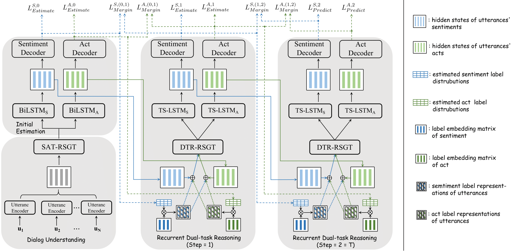

# DARER
This repository contains the PyTorch source Code for our paper: **[DARER: Dual-task Temporal Relational Recurrent Reasoning Network
for Joint Dialog Sentiment Classification and Act Recognition](https://arxiv.org/abs/2203.03856)**.

**[Bowen Xing](https://scholar.google.com/citations?hl=zh-CN&user=DpBvmGQAAAAJ)** and **[Ivor W. Tsang](https://scholar.google.com/citations?user=rJMOlVsAAAAJ&hl=zh-CN)**.

***ACL 2022 (Findings)***.

## Architectures

DARER's Architecture:




## Requirements
Our code relies on Python 3.6 and following libraries:
- transformers==1.1.0
- torch-geometric==1.7.0
- torch==1.5.0
- tqdm==4.60.0
- transformers==3.3.1
- numpy==1.19.2
- scikit-learn==0.24.2

## Run: 
LSTM-based Encoder:

DARER/
``` shell script
    # Mastodon //glove
    python -u main.py -lr 1e-3 -l2 1e-8 -dd dataset/mastodon -hd 128 -mc 2 -dr 0.2 -sn 3
  
    # DailyDialog // glove
    python -u main.py -ne 50 -hd 300 -lr 1e-3 -l2 1e-8 -dd dataset/dailydialogue -rnb 10 -sn 2 -mc 5 -dr 0.5
    # DailyDialog // train random word vector 
    python -u main.py -ne 50 -hd 256 -lr 1e-3 -l2 1e-8 -dd dataset/dailydialogue -sn 1 -mc 1e-05 -dr 0.3 -rw

```
PTLM(pre-trained language model)-based Encoder:

DARER/pre-trained language model/
``` shell script
    # Mastodon // BERT
    python -u main.py -pm bert -bs 16 -sn 4 -dr 0.3 -hd 768 -l2 0.01 -blr 1e-05 -mc 1
    # Mastodon // RoBERTa
    python -u main.py -pm roberta -bs 16 -sn 4 -dr 0.14 -hd 768 -l2 0.0 -blr 1e-05 -mc 1
    # Mastodon // XLNet
    python -u main.py -pm xlnet -bs 12 -sn 4 -dr 0.2 -hd 256 -l2 0.0 -blr 1e-05 -mc 1
```
We recommend you search the optimal hyper-parameters on your server to obtain the best performances in your own experiment environment.

## Citation
If the code is used in your research, please star this repo ^_^ and cite our paper as follows:

<pre>
@inproceedings{xing-tsang-2022-darer,
    title = "{DARER}: Dual-task Temporal Relational Recurrent Reasoning Network for Joint Dialog Sentiment Classification and Act Recognition",
    author = "Xing, Bowen  and
      Tsang, Ivor",
    booktitle = "Findings of the Association for Computational Linguistics: ACL 2022",
    month = may,
    year = "2022",
    address = "Dublin, Ireland",
    publisher = "Association for Computational Linguistics",
    url = "https://aclanthology.org/2022.findings-acl.286",
    doi = "10.18653/v1/2022.findings-acl.286",
    pages = "3611--3621",
}
</pre>
